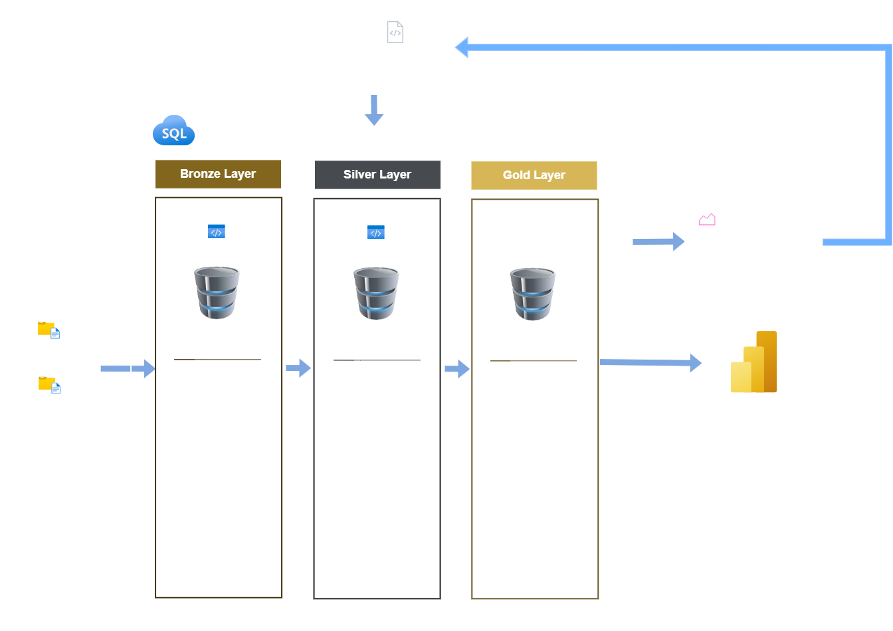
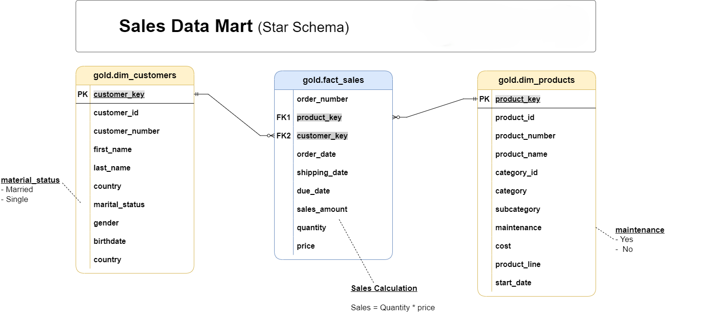

# 🚀 End-to-End Data Engineering Project | SQL, Python, Power BI

This project demonstrates an end-to-end **Data Engineering solution** built using SQL, Python, and Power BI — covering the complete lifecycle from raw data ingestion to business insights.

---

## 📌 Solution Overview


The goal of this project is to design and implement a **scalable data warehouse** using a Medallion Architecture approach:

* **Bronze Layer** → Raw data ingestion from ERP & CRM sources
* **Silver Layer** → Data cleaning, transformation, and standardization
* **Gold Layer** → Business-ready star schema for analytics

The project also includes **pipeline monitoring, data quality checks, and interactive dashboards**.

---
## 🎯 Business Impact

- 📉 Reduced data inconsistencies through validation checks
- ⚡ Improved query performance with optimized schema design
- 📊 Enabled near real-time insights via automated batch pipelines
- 🔍 Increased visibility into pipeline health and data quality

---


## 🧰 Tech Stack

- **Data Warehouse:** SQL Server  
- **ETL & Pipelines:** Python, SQL  
- **Data Modeling:** Star Schema  
- **Visualization:** Power BI  
- **Architecture:** Medallion (Bronze, Silver, Gold)  
---

## 🔍 Pipeline Monitoring

This project includes a **pipeline observability layer** that tracks ETL execution, data quality checks, and step-level performance.


## 🏗️ Architecture

* Designed using **Medallion Architecture (Bronze → Silver → Gold)**
* Built with **SQL Server + Python ETL pipelines**
* Data modeled using **Star Schema (Fact & Dimension tables)**


---

## 🔄 End-to-End Data Flow

1. **Data Ingestion (Bronze Layer)**
   - Raw CSV data ingested from ERP & CRM systems
   - Stored as-is using batch processing

2. **Data Transformation (Silver Layer)**
   - Data cleaning, normalization, and enrichment
   - Standardized schema for consistency

3. **Data Modeling (Gold Layer)**
   - Star schema with fact and dimension tables
   - Aggregated and analytics-ready datasets

4. **Monitoring & Observability**
   - Pipeline run logs and step-level tracking
   - Data quality checks and validation metrics

5. **Consumption Layer**
   - Power BI dashboards for business insights


   

---

## 📡 Pipeline Observability & Monitoring

This project includes a custom-built monitoring system:

- Pipeline run tracking (status, duration, rows processed)
- Step-level logging for debugging failures
- Data quality checks stored and reported
- Performance metrics for optimization

**Monitoring Tables:**
- `pipeline_run_log`
- `step_log`
- `pipeline_row_counts`
- `data_quality_summary`
---


## ⚙️ Core Capabilities

### 🔹 Data Engineering

* Automated ETL pipelines using SQL & Python
* Modular SQL scripts (DDL + transformations)
* Data ingestion from multiple sources (ERP & CRM)

### 🔹 Data Quality & Monitoring

* Pipeline run tracking (success/failure)
* Data quality validation checks
* Execution time monitoring

### 🔹 Data Modeling

* Fact and dimension tables for analytics
* Cleaned and normalized datasets
* Optimized queries for reporting

### 🔹 Business Intelligence

* Interactive **Power BI dashboards**
* KPI tracking (Sales, Customers, Orders)
* Product & regional performance analysis

---

## 📊 Dashboard Overview

### 📈 Sales Dashboard
* 📈 Sales performance overview
* 🌍 Revenue by country
* 🛍️ Product category insights
* ⚙️ Pipeline health monitoring


### 🛍️ Product Analysis
Provides insights into product categories, subcategories, and customer segments.


---

## 🧱 Data Model (Star Schema)

The Gold layer is designed using a **star schema** for high-performance analytics:

### Fact Table
- `fact_sales` → transactional sales data

### Dimension Tables
- `dim_customers`
- `dim_products`
- `date`

### Additional Analytical Models
- KPI measures (MoM growth, YoY, success rate)
- Pipeline monitoring datasets

This design enables fast aggregations and scalable reporting.


---

## 🚀 Project Requirements

### 🏗️ Data Warehouse (Data Engineering)

#### 🎯 Objective

Build a SQL Server data warehouse to consolidate CRM and ERP data into an analytics-ready model for reporting and decision-making.

#### ⚙️ Key Features
Data Ingestion
Load CSV data (CRM, ERP) into the Bronze layer using batch processing and SQL stored procedures.
Data Cleaning
Handle nulls, duplicates, and standardize fields in the Silver layer.
Data Integration
Combine multiple sources into a unified, consistent schema.
Data Modeling
Create a star schema (fact + dimensions) in the Gold layer using views.
Pipeline Automation
Orchestrate Bronze → Silver → Gold using Python (manual/scheduled runs).
Monitoring & Quality
Track pipeline runs, step-level execution, and data quality checks.

---

## 📂 Repository Structure

```
datasets/        → Raw source data  
docs/            → Dashboard View, Architecture & data model diagrams  
scripts/         → ETL pipelines (Bronze, Silver, Gold)  
tests/           → Data quality checks  
pipeline/        → Python pipeline execution scripts  
reports/         → Powerbi Dashboard
```

---

## 📥 Download Dashboard

You can download and explore the Power BI dashboard:

[Download PBIX](https://github.com/SyedKazimRazaN/sql-data-warehouse-project/raw/main/reports/DataWarehouse_Dashboard.pbix)

---

## 👨‍💻 About Me

I am a **Data Engineer specializing in GCP, ETL pipelines, and analytics dashboards**, focused on building scalable data solutions and transforming raw data into actionable insights.

---

## 📬 Let’s Connect

If you're looking for help with:

* Data pipelines
* Data warehouse design
* Power BI dashboards

Feel free to reach out!
